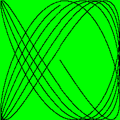

# Just a gif

Just an example of generating GIF file using Golang.
This example is taken from the book "The Go Programming Language" by Alan A. A. Donovan and Brian W. Kernighan

## What GIF is created?
This program creates a gif of the [Lissajous curvesh](ttps://pt.wikipedia.org/wiki/Curvas_de_Lissajous)

## How to run:
	$ go run main.go > out.gif

## Donations:
Good vibes

